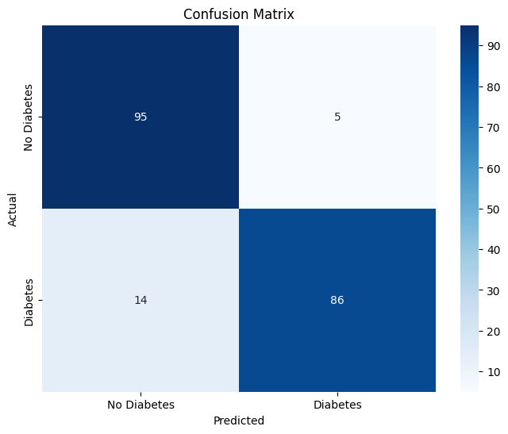
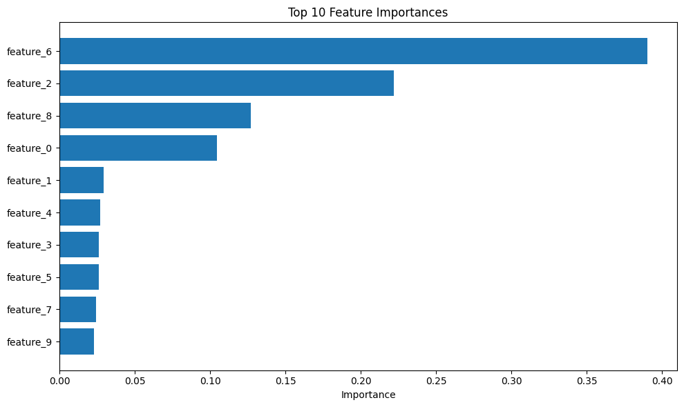

# Diabetes Prediction using Random Forest

This project aims to predict the likelihood of diabetes in patients based on various health indicators using Machine Learning.

## Features
- **Data Cleaning:** Handling missing values and feature selection.
- **Model:** Random Forest Classifier with Hyperparameter tuning via `GridSearchCV`.
- **Metrics:** Focused on F1-Score to handle class imbalance.

## 📊 Results & Visualizations

### 1. Confusion Matrix

### 2. Feature Importance

## How to use
1. Clone the repository.
2. Install dependencies: `pip install -r requirements.txt`.
3. Run the Jupyter Notebook.
